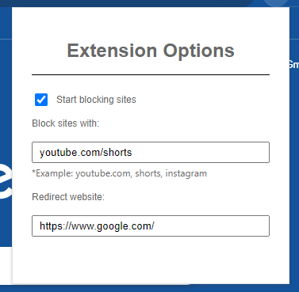

# Website Blocker Extension

## Overview
This browser extension allows users to block websites based on URLs or keywords that are part of a blacklist. When a user attempts to visit a blocked site, the extension automatically redirects them to a specified website of their choice. It provides a simple yet effective way to control browsing behavior and manage distractions.

## Features
- **URL Blocking**: Block specific websites by adding their URLs to a customizable blacklist.
- **Keyword Blocking**: Block websites that contain certain keywords in their URL.
- **Redirection**: Automatically redirect blocked websites to a user-defined URL.

## Installation Steps
To use the Website Blocker Extension, follow these steps:

1. **Download the Extension**
   - Navigate to the [GitHub repository](https://github.com/TarcisioBueno/site-blocker-browser-extension) and click on the **Code** button.
   - Select **Download ZIP** to download the extension files to your computer.
   - Extract the ZIP file to a folder on your computer.

2. **Load the Extension in Your Browser**
   - Open your browser (Chrome is used as an example here).
   - Navigate to `chrome://extensions/`.
   - Enable **Developer mode** by toggling the switch in the upper right corner.
   - Click on **Load unpacked** and select the folder where you extracted the extension files.

3. **Set Up the Extension**
   - Click on the extension icon in your browser toolbar to open the settings popup.
   - Add the keywords or URLs you want to block.
   - Enter the URL where you would like to redirect blocked sites.

## Technologies Used
- **JavaScript**: The extension is built entirely with vanilla JavaScript.
